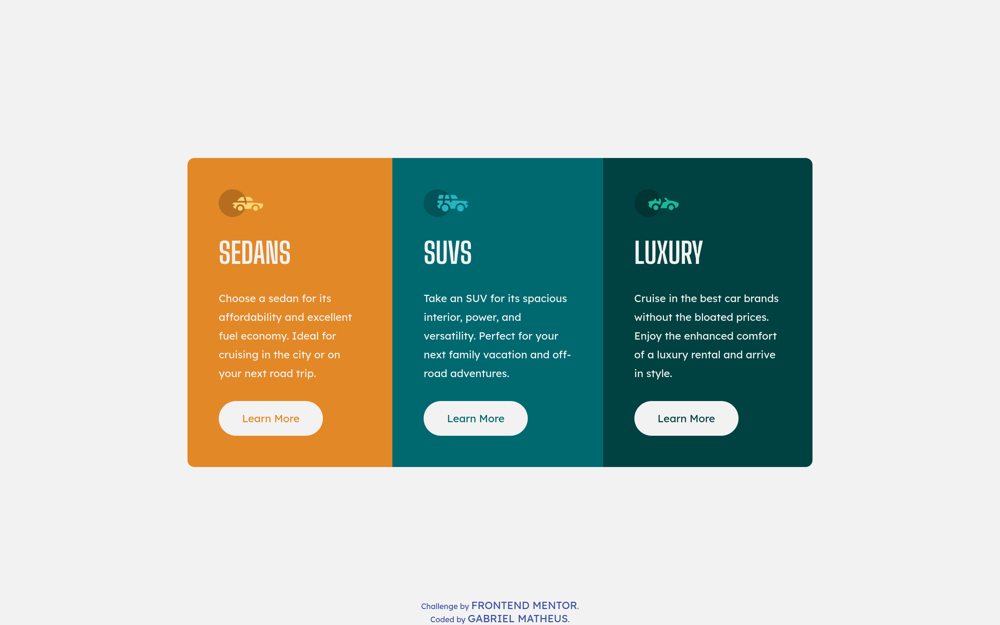

# Frontend Mentor - 3-column preview card component solution

This is a solution to the [3-column preview card component challenge on Frontend Mentor](https://www.frontendmentor.io/challenges/3column-preview-card-component-pH92eAR2-). Frontend Mentor challenges help you improve your coding skills by building realistic projects. 

## Table of contents

- [Frontend Mentor - 3-column preview card component solution](#frontend-mentor---3-column-preview-card-component-solution)
  - [Table of contents](#table-of-contents)
  - [Overview](#overview)
    - [The challenge](#the-challenge)
    - [Screenshot](#screenshot)
    - [Links](#links)
  - [My process](#my-process)
    - [Built with](#built-with)
    - [What I learned](#what-i-learned)
    - [Continued development](#continued-development)
    - [Useful resources](#useful-resources)
  - [Author](#author)

**Note: Delete this note and update the table of contents based on what sections you keep.**

## Overview

### The challenge

Users should be able to:

- View the optimal layout depending on their device's screen size
- See hover states for interactive elements

### Screenshot

### Links

- [Solution URL](https://github.com/gbmatheus/3-column-preview-card-component)
- [Live Site URL](three-column-preview-card-component.netlify.app)

## My process

### Built with

- Semantic HTML5 markup
- Mobile-first workflow
- Flexbox
- [BEM](https://en.bem.info/methodology/)

**Note: These are just examples. Delete this note and replace the list above with your own choices**

### What I learned

As this challenge consists of creating 3 similar cards for your style. I could make use of BEM so that these components could be reused.

### Continued development

Maybe by CSS.

### Useful resources

- [A Complete Guide to Flexbox](https://css-tricks.com/snippets/css/a-guide-to-flexbox/) - Isso me ajudou pelo motivo no entendimento de algumas propriedades do display flexbox.

## Author

- Github - [gbmatheus](https://github.com/gbmatheus)
- Frontend Mentor - [@gbmatheus](https://www.frontendmentor.io/profile/gbmatheus)
